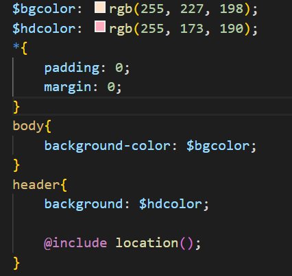
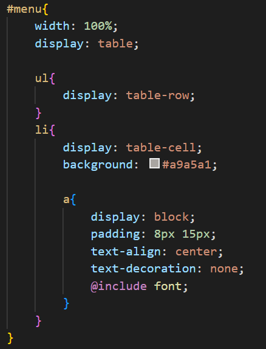
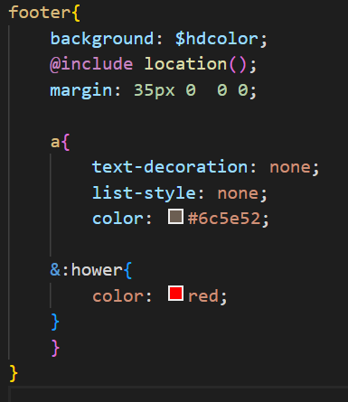
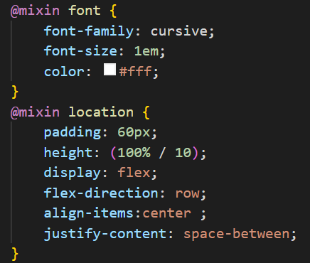
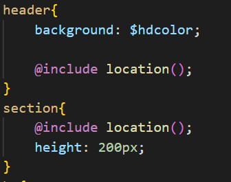
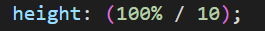
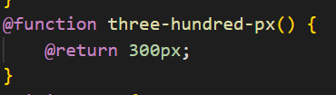
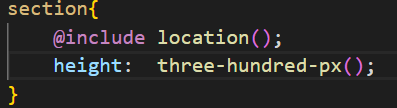

#  Использование SACSS/SCSS в верстке сайтов #
После изучения SACSS/SCSS можно подчеркнуть следующие преимущества использования перед CSS 
## 1. Работа с перменными.##
В переменные можно записывать различные значения для любого свойства, и в дальнейшем использовать значение конкретной переменной. Возможность сократить код, используя переменные, меняя их значение. 

## 2. Вложенные стили.##
Влрженные стили позволяют написать код колее чисто и уменьшить количество повторяющихся элементов. Данная функция позволяет группировать стили одного объета, и объектов, находящихся внутри него. Таким образом, при управлении загруженными макетами будет легче найти нужную часть кода.

## 3. Амперсанд.##
Данная функция позволяет уменьшить количество строк кода, а так же показывает свой родительский элемент.При использовании амперсанда перед селектором внутри набора правил, селектор прикладывается к родительскому, что особенно удобно при использовании псевдоклассов  :hover или ::after. 

## 4. Миксины.##
Позволяют один раз создать набор CSS-свойств и работать с ними повторно или смешивать с другими значениями. Миксины можно использовать для создания отдельных тем одного макета. Примеси также могут содержать целые CSS-правила или что-либо другое, разрешённое в Sass-документе. Они даже могут принимать аргументы, что позволяет создавать большое разнообразие стилей при помощи небольшого количества миксинов.

## 5. Математические операции.##
Использование SCSS позволяет складывать, вычитать, выявлять остаток, умножать и делить значения CSS. В отличие от стандартного CSS, Sass/SCSS позволяют обойтись без calc(). Работают операции при совместимых типах данных.

## 5. Функции.##
При использовании SASS/SCSS можно использовать функции так же, как и в других языках. Например функции в Sass могут возвращать любое корректное значение CSS и могут быть назначены любому свойству. 

# Итог#
Проанализировав работу SCSS/SASS и CSS, можно сделать вывод, что использование SCSS/SASS упрощает работу при написании кода, сокращает количество строк, и дает большее понимание написанного кода, чем CSS.
